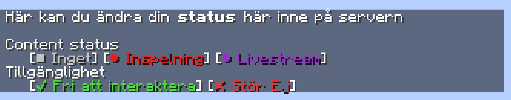

# status

A simple Minecraft datapack that allows players to change their in-game status.  
*Without the players having to be OP!!, only in swedish*  

Command to open up the status menu:  
`/trigger status`  

This uses teams to change the players prefix to the status they have chosen.  

## The status menu

Just click on the status you want to change to.  

## Formatting

Players names will be formatted as follows:  
<`<availability> <content status> | <player name>`> `chat message`  
With their respective icons from the status menu being used.  

## Player ordering

The players will be ordered in the following order:  
1. `Available Livestream`  
1. `Unavailable Livestream`  
1. `Available Recording`  
1. `Unavailable Recording`  
1. `Available None`  
1. `Unavailable None`  